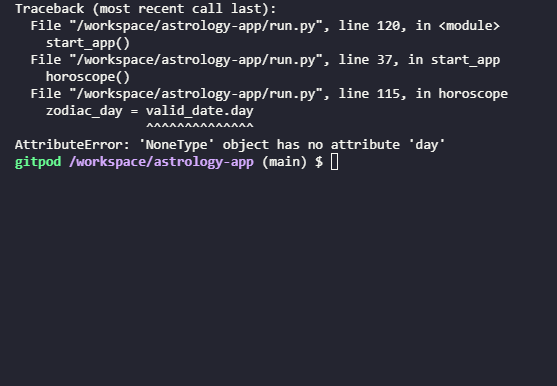

# Astrology App

This is a simple astrology within a Python terminal. This app is capable of generating and interpretating your birth chart (all is required is your date of birth, time of birth and location of your birth), give your  daily, weekly, monthly, or even yearly horoscope. 

Whether you're a believer in astrology or not, it's still a fun way to find out more about yourself.

# User Stories

* As a first time user, I would like to find out new information about myself.
* As a first time user, I would like to find a clear guided app that doesn't confuse me.

# Bugs

## Zodiac sign doesn't show up (AttributeError)

When I first implemented the `get_zodiac_sign()` function in the `horoscope()` function, I'd get the following error message: 

The fix as easy though: Instead of a simple `return` to exit the function, I put in `return valid_date` which fixed the bug