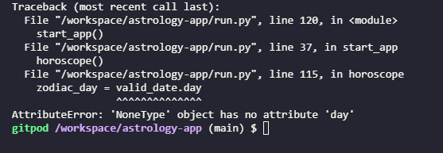

# Astrology App

This is a simple astrology app that works within a terminal. The app offers a comprehensive set of features that deliver personalized astrological insights. Users can input their birth details (date, time and location) to generate detailed birth charts, including information like the sun sign (the main zodiac sign), the moon sign or the ascendant sign. The app can also provide a user's daily, weekly, monthly and even yearly horoscopes depending in the user's zodiac sign, helping them to gain insights into their daily lives or to see any long-term trends. The app offers accurate and insightful astrological guidance, whilst maintaining a user-friendly design and has a robust validation process in place.

# Project Goals

The main goal of this app is to generate meaningful insights into the user's lives, by leveraging APIs and external libraries like Kerykeion and BeautifulSoup. User expectations are met, such as:

* Providing accurate astrological data into visually-appealing birth chart reports that can be saved for future reference
* Providing detailed daily, weekly, monthly and yearly horoscopes 
* Providing compatibility horoscopes to gain insights into possible compatibility issues and/or advantages.

# Target Audience

This app is targeted at people who genuinely believe that the planets' position affects a person's personality, and/or the outcome of their life. This is also dedicated to people that follow horoscope reading for fun and may not fully believe in astrology. Since young adults and teenagers seem to be more interested in horoscopes and birth charts, this app could appeal to them as well.

## User Stories

* As a user, I want to input my birth details so that I can receive a personalized birth chart. 
* As a user, I want to see my daily horoscope so that I can plan my day accordingly.
* As a user, I want to make sure that my input is validated so that I can get accurate information.
* As a user, I want to learn more about the significance of planetary positions so that I can understand my astrological profile better. 

# Deployment and Local Development

The app was developed using the Gitpod IDE and the repository can be found on GitHub. The app was deployed on Heroku; see [live website here](https://astrology-app-8b0fad7f55e1.herokuapp.com/).

## Deployment

1. Log in to **[Heroku](https://www.heroku.com/)** if you already have an account with them. If not, **[create an account](https://signup.heroku.com/)**.
2. Once signed in, click on the "**Create New App**" button located above your dashboard. Give your app a unique name, choose the region you're in (United States/Europe) and click "**Create app**".
3. Before deploying, you need to go to the **Settings** tab. Once there, scroll down and click on **Reveal Config Vars** to open this section.
4. In the **KEY** field, enter `PORT`; in the adjacent field called **VALUE**, enter `8000`. *If this isn't done, deployment won't be successful*.
5. Additionally, if you have credentials from your APIs, make sure to enter them as well. In the next **KEY** field, enter `CREDS`; in the **VALUE** field, enter your `creds.json` content, and click **Add**.
6. Underneath the **Config Vars** section, in the **Buildpacks** section, click **Add Buildpack**. Select `Python` first, and then add  `Node.js`. Note that it is important to have `Python` on top of `Node.js`. If that's not the case, they can be easily rearranged.
7. Now, go to the **Deploy** tab. Once there, in the **Deployment Method** section, click `GitHub` and if needed, authorize `GitHub` to access your `Heroku` account. Click **Connect to GitHub**.
8. Once connected, look up your GitHub repository by entering the name of it under **Search for a repository to connect to** and click **Search**. After you've found your repo, click **Connect**. 
9. Now, you can click on **Enable Automatic Deploys** (optional, but I'd recommend it to save time and to detect any issues should they arise), and then select **Deploy Branch**. *If you enabled automatic deploys, every time you push changes to GitHub, the app will be automatically deployed every time, just like you would with a webpage deployed on GitHub Pages*.
10. The app can take a couple of minutes until it's deployed. Once it's done, you'll see the message **Your app was successfully deployed** and a **View** button will come up where you can see your deployed app. 

## Local Development

### How to Clone
1. Log into your account on GitHub
2. Go to the repository of this project /petra66orii/astrolgy-app/
3. Click on the code button, and copy your preferred clone link
4. Open the terminal in your code editor and change the current working directory to the location you want to use for the cloned directory
5. Type 'git clone' into the terminal, paste the link you copied in step 3 and press enter

### How to Fork
To fork the repository:
1. Log in (or sign up) to Github.
2. Go to the repository for this project, petra66orii/astrology-app
3. Click the Fork button in the top right corner

# Bugs

## Zodiac sign doesn't show up (AttributeError)

When I first implemented the `get_zodiac_sign()` function in the `horoscope()` function, I'd get the following error message: 

The fix as easy though: Instead of a simple `return` to exit the function, I put in `return valid_date` which fixed the bug