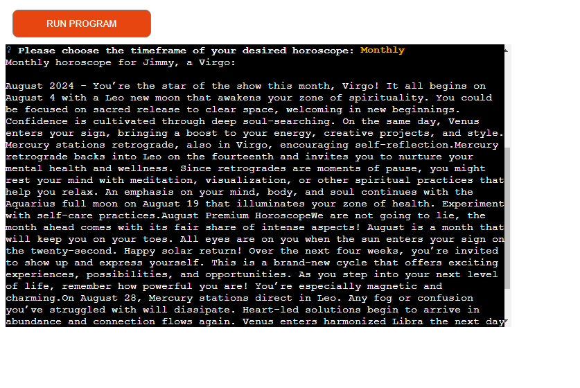
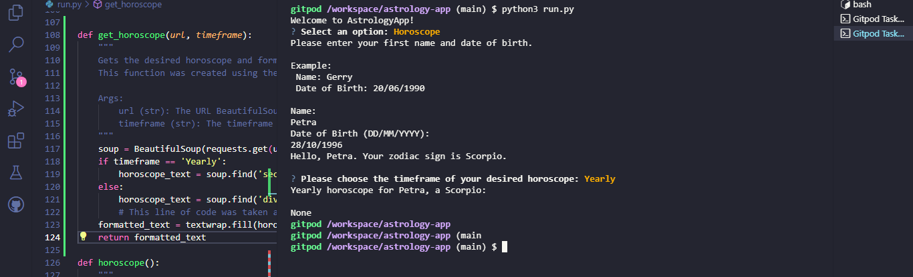
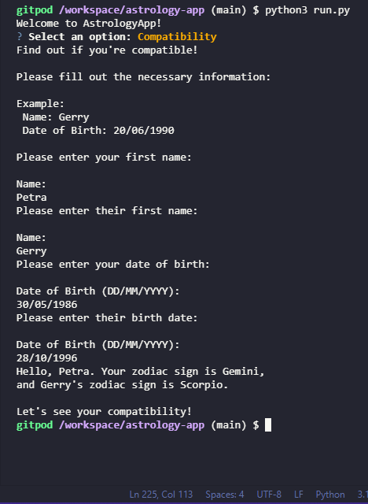
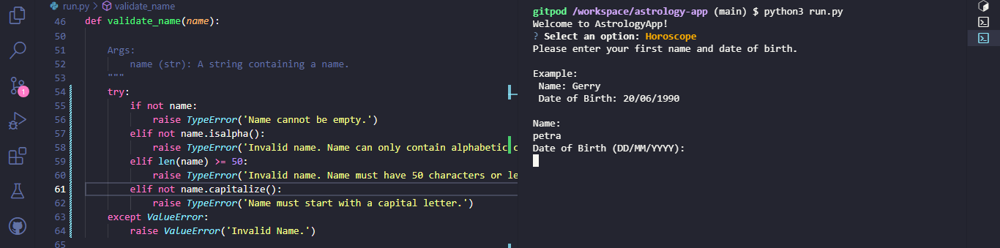
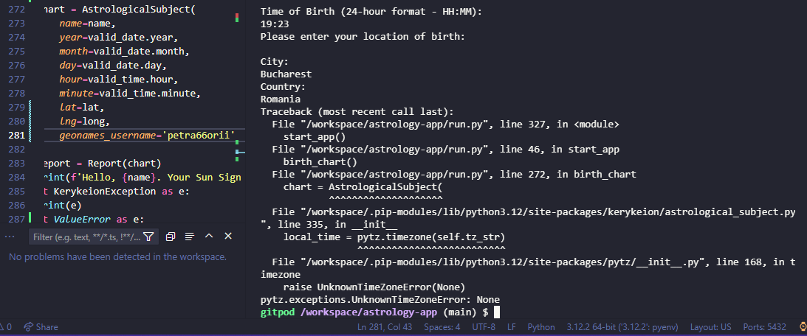
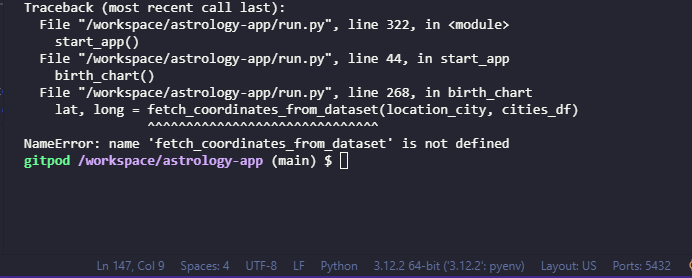
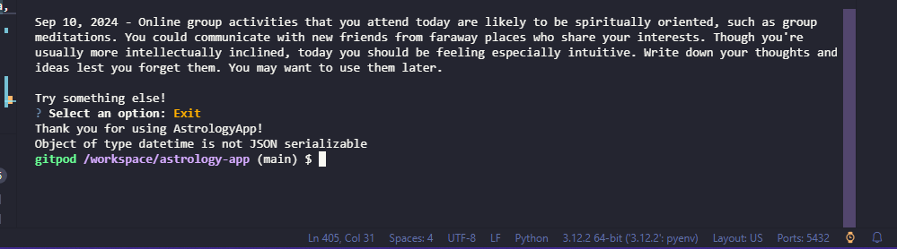

# Astrology App

This is a simple astrology app that works within a terminal. The app offers a comprehensive set of features that deliver personalized astrological insights. Users can input their birth details (date, time and location) to generate detailed birth charts, including information like the sun sign (the main zodiac sign), the moon sign or the ascendant sign. The app can also provide a user's daily, weekly, monthly and even yearly horoscopes depending in the user's zodiac sign, helping them to gain insights into their daily lives or to see any long-term trends. The app offers accurate and insightful astrological guidance, whilst maintaining a user-friendly design and has a robust validation process in place.

# Table of Contents 
1. **[Project Goals](#project-goals)**
2. **[Target Audience](#target-audience)**
    * [User Stories](#user-stories)
3. **[Features](#features)**
    * [Future Implementations](#future-implementations)
4. **[Technologies](#technologies)**
    * [Libraries](#libraries)
5. **[Deployment and Local Development](#deployment-and-local-development)**
    * [Deployment](#deployment)
    * [Local Development](#local-development)
        + [How to Clone](#how-to-clone)
        + [How to Fork](#how-to-fork)
6. **[Testing](#testing)**
    * [Bugs](#bugs)
        + [Bug #1 - Zodiac sign doesn't show up](#bug-1---zodiac-sign-doesnt-show-up-attributeerror)
        + [Bug #2 - Words getting broken up in the terminal](#bug2---words-getting-broken-up-in-the-terminal)
        + [Bug #3 - Yearly horoscope displays `None`](#bug3---yearly-horoscope-displays-none)
        + [Bug #4 - Content wouldn't display](#bug4---content-wouldnt-display)
        + [Bug #5 - Input validation rule for capital letter didn't work](#bug5---input-validation-rule-for-capital-letter-didnt-work)
        + [Bug #6 - `AstrologicalSubject()` didn't work](#bug6---astrologicalsubject-didnt-work)
        + [Bug #7 - Fetch coordinates function not defined](#bug7---fetch-coordinates-function-not-defined)
        + [Bug #8 - Datetime object not JSON serializable](#bug8---datetime-object-not-json-serializable)
7. **[Credits](#credits)**
    * [Code Used](#code-used)
        + [Library Documentation](#library-documentation)
        + [Webpages](#webpages)
    * [Content](#content)
8. **[Acknowledgements](#acknowledgements)**

# Project Goals

The main goal of this app is to generate meaningful insights into the user's lives, by leveraging APIs and external libraries like Kerykeion and BeautifulSoup. User expectations are met, such as:

* Providing accurate astrological data into visually-appealing birth chart reports
* Providing detailed daily, weekly, monthly and yearly horoscopes 
* Providing compatibility horoscopes to gain insights into possible compatibility issues and/or advantages.

# Target Audience

This app is targeted at people who genuinely believe that the planets' position affects a person's personality, and/or the outcome of their life. This is also dedicated to people that follow horoscope reading for fun and may not fully believe in astrology. Since young adults and teenagers seem to be more interested in horoscopes and birth charts, this app could appeal to them as well.

## User Stories

* As a user, I want to input my birth details so that I can receive a personalized birth chart. 
* As a user, I want to see my daily horoscope so that I can plan my day accordingly.
* As a user, I want to make sure that my input is validated so that I can get accurate information.
* As a user, I want to learn more about the significance of planetary positions so that I can understand my astrological profile better. 

# Features

## Future Implementations

This turned out to be one of my favorite projects and I'd love to expand more on it. A few of these future implementations would be:

* Implement an AI API (OpenAI) to interpret the birth chart and give personalized insights about the user's personality and life. This was the initial plan to elevate the birth chart function, but unfortunately the OpenAI API is not free anymore. But I would definitely implement this further down the line.
* Produce charts and give the user the ability to save their personalized charts along with the interpretation. 
* Offer a crash course into understanding the planets and houses systems: while making this project, astrology tunred out to be a lot more complex than what is usually seen in newspapers and websites. A little section within the app that explains the more complex concepts of astrology could prove useful for the user to better understand what to look for when using an astrology app.
* Build a Streamlit webpage for better UX design; Streamlit is a very neat Python library that can be used to build websites quickly. Given that Streamlit isn't required to make the app fully functional, but is merely a means of making the website better looking, I've decided to leave Streamlit implementation for now.

# Technologies

The main technologies used for building this app:

* **Python** - As seen, this project was created by solely using Python.
* **Gitpod** - The IDE where all the coding and commits have been done
* **GitHub** - Where the website is stored and pushed.
* **Heroku** - The website was deployed on Heroku due to it being a terminal-based app.
* **Google Cloud** - The APIs required for this project were used through Google Cloud.
* **draw.io** - The flowchart was created using draw.io.
* **Kaggle** - I used the Kaggle platform to find the coordinates dataset.

## Libraries

This project turned out to be more complex than I initially imagined, so I made use of Python's very extensive selection of libraries:

* **`gspread`** - This library is used to link the app to Google Sheets where data is stored
* **`google.oauth2.service_account`** - Used to import the credentials containing personal information 
* **`datetime`** - Used to format and validate dates and times for the app 
* **`requests`** - Used to enable requests for web scraping
* **`bs4 (BeautifulSoup)`** - This library was used for the **Horoscope** and **Compatibility** sections.
* **`Kerykeion`** - This library was used for the generation if birth chart based on user input.
* **`pandas`** - This library was used to clean the dataset and import it in the app.
* **`pickle`** - Used with **`gzip`** to compress the dataset given its large size.
* **`gzip`** - Used to compress the dataset to reduce its size (original size was 95MB).
* **`timezonefinder`** - Used to calculate the time zone given coordinates.
* **`pytz`** - Added for extra functionality and timezones together with **`timezonefinder`**.
* **`questionary`** - This library was used to make the app more user-friendly.
* **`textwrap`** - Used with **`shutil`** to wrap the text in the terminal without getting words broken up.
* **`shutil`** - Used with **`textwrap`** 
* **`json`** - Used to convert the datetime objects into serialized json format.

# Deployment and Local Development

The app was developed using the Gitpod IDE and the repository can be found on GitHub. The app was deployed on Heroku; see [live website here](https://astrology-app-8b0fad7f55e1.herokuapp.com/).

## Deployment

*!!! Important: If using BeautifulSoup4, using pip3 freeze for requirements.txt won't add beautifulsoup4 to the file, so it needs to be introduced manually as beautifulsoup4==4.12.3 or later versions.*

1. Log in to **[Heroku](https://www.heroku.com/)** if you already have an account with them. If not, **[create an account](https://signup.heroku.com/)**.
2. Once signed in, click on the "**Create New App**" button located above your dashboard. Give your app a unique name, choose the region you're in (United States/Europe) and click "**Create app**".
3. Before deploying, you need to go to the **Settings** tab. Once there, scroll down and click on **Reveal Config Vars** to open this section.
4. In the **KEY** field, enter `PORT`; in the adjacent field called **VALUE**, enter `8000`. *If this isn't done, deployment won't be successful*.
5. Additionally, if you have credentials from your APIs, make sure to enter them as well. In the next **KEY** field, enter `CREDS`; in the **VALUE** field, enter your `creds.json` content, and click **Add**.
6. Underneath the **Config Vars** section, in the **Buildpacks** section, click **Add Buildpack**. Select `Python` first, and then add  `Node.js`. Note that it is important to have `Python` on top of `Node.js`. If that's not the case, they can be easily rearranged.
7. Now, go to the **Deploy** tab. Once there, in the **Deployment Method** section, click `GitHub` and if needed, authorize `GitHub` to access your `Heroku` account. Click **Connect to GitHub**.
8. Once connected, look up your GitHub repository by entering the name of it under **Search for a repository to connect to** and click **Search**. After you've found your repo, click **Connect**. 
9. Now, you can click on **Enable Automatic Deploys** (optional, but I'd recommend it to save time and to detect any issues should they arise), and then select **Deploy Branch**. *If you enabled automatic deploys, every time you push changes to GitHub, the app will be automatically deployed every time, just like you would with a webpage deployed on GitHub Pages*.
10. The app can take a couple of minutes until it's deployed. Once it's done, you'll see the message **Your app was successfully deployed** and a **View** button will come up where you can see your deployed app. 

## Local Development

### How to Clone
1. Log into your account on GitHub
2. Go to the repository of this project /petra66orii/astrolgy-app/
3. Click on the code button, and copy your preferred clone link
4. Open the terminal in your code editor and change the current working directory to the location you want to use for the cloned directory
5. Type 'git clone' into the terminal, paste the link you copied in step 3 and press enter

### How to Fork
To fork the repository:
1. Log in (or sign up) to Github.
2. Go to the repository for this project, petra66orii/astrology-app
3. Click the Fork button in the top right corner

# Testing

## Bugs

### Bug #1 - Zodiac sign doesn't show up (AttributeError)

When I first implemented the `get_zodiac_sign()` function in the `horoscope()` function, I'd get the following error message: 

**Solution**: Instead of a simple `return` to exit the function, I put in `return valid_date` which fixed the bug.

### Bug#2 - Words getting broken up in the terminal 

When the content was displayed in the terminal, the words would get broken up, like this: 

**Solution**: Import `shutil` and `textwrap`, and use its methods to wrap words so they're not broken up anymore. *(Note: More formatting still needed though for aesthetic purposes.)*

### Bug#3 - Yearly horoscope displays `None`

After refactoring code for the `horoscope()` function and defining the `get_horoscope()` function, whenever I'd select "Yearly" as my option, the terminal would display `None` as shown in the screenshot. 

**Solution**: As seen in the left side where the code is, there was an indentation error in `get_horoscope()`. Once the indentation was fixed, the code worked just fine. 

### Bug#4 - Content wouldn't display 

When defining the `get_compatibility()` function, the content wouldn't display.

**Solution**: `print` has to come before the `return` keyword. I had them the other way around.

### Bug#5 - Input validation rule for capital letter didn't work

**Solution**: Instead of using `capitalize()`, which returns a new string instead of modifying the original string, using string indexing and the `isupper()` method fixed the issue.

### Bug#6 - `AstrologicalSubject()` didn't work

For the `AstrologicalSubject()` class, the documentation suggests using latitude and longitude coordinates, and also timezones. Since this kind of input would drive the user straight out of the app, I decided to instead create a GeoNames account to be able to input the city name; unfortunately, this didn't work either. 

After a couple of hours of research and trying to find a Python geocoding library (what I found were APIs that were charging money), I've decided to import a dataset from **[Kaggle](https://www.kaggle.com/)**, clean it using `pandas`, and build a function (`fetch_coordinates_from_dataset()`) that matches the coordinates with the city the user inputs. Those coordinates are then used as parameters for the `AstrologicalSubject()` instance. 

That still didn't work. 

Whilst the location issue was fixed, the error in the terminal indicated that the timezone couldn't be calculated and hence the birth chart couldn't be calculated.

**Solution**: Install and import `timezonefinder`, along with `pytz` from Python to define a `fetch_timezone()` function; after inputting the timezone in the parameters as well, `AstrologicalSubject()` worked.

### Bug#7 - Fetch coordinates function not defined 

When I first ran the function, I got this message: 

**Solution**: It was an indentation error; the whole function was indented, making it nested within the `prompt_user_for_time()` function. 

### Bug#8 - Datetime object not JSON serializable 

When developing the `update_worksheet()` function, I got this error:

**Solution**: This [article](https://www.geeksforgeeks.org/how-to-fix-datetime-datetime-not-json-serializable-in-python/) gave the magic solution: import `json` library and use its methods to convert datetime objects into strings.

# Credits

## Code Used

Since Python is extremely versatile and has a library for almost everything I need, I'll separate this section between `Library Documentation` and `Webpages` to distinguish between code that I used from documentation and code used from website articles/projects.

### Library Documentation

* [`Kerykeion`](https://www.kerykeion.net/pydocs/kerykeion.html) - Documentation came in handy when writing the `birth_chart` function. All the data and calculations in this function are provided through Kerykeion's `AstrologicalSubject()` class. Also used the `Report()` and `print_report()` to generate and display a nice table containing all the user's astrological information.
* [`datetime`](https://docs.python.org/3/library/datetime.html#format-codes) - For finding the best way to format datetime objects; I used it to validate birth dates and times of birth as well.
* [`Questionary`](https://questionary.readthedocs.io/en/stable/pages/quickstart.html#) - I used the quickstart guide to provide a pleasant UX through the use of arrow keys to navigate the app when selecting options.
* [`BeautifulSoup4`](https://www.crummy.com/software/BeautifulSoup/bs4/doc/) - Used BeautifulSoup to request and display data from this [website](https://www.horoscope.com/us/index.aspx). Further credits using BeautifulSoup are shown [here](#webpages).
* [`timezonefinder`](https://timezonefinder.readthedocs.io/en/latest/1_usage.html) - This documentation came in very handy for calculating the timezone based on the coordinates provided, so I didn't have to ruin the UX by requesting manual input from the user.
* [`gzip`](https://docs.python.org/3/library/gzip.html#examples-of-usage) - Used gzip to compress the dataset containing coordinates for every location. The original dataset was 95MB, which is very large for the purpose of this project; in order to fix this, I used gzip's `open` method to compress the dataset. I've deleted the initial lines of code where the compression took place in order to avoid additional redundant compressing that could've affected the data. The code used can be seen in this past [commit](https://github.com/petra66orii/astrology-app/commit/d9a96b7bc2c1e56e9bcf4d7db8a7143ded746fdf?diff=unified&w=0). *Note: `shutil` library was also used in this section as seen in the documentation. This is used in a different function as well and it is credited in the [**Webpages**](#webpages) section.*
* [`pandas`](https://pandas.pydata.org/docs/reference/frame.html) - **pandas** is like an old friend of mine; I've used **pandas** whilst doing the [Google Advanced Data Analytics](https://www.coursera.org/professional-certificates/google-advanced-data-analytics) course, so I was already familiar with it. Still, I made use of the documentation for a little refresher on the `iloc` method. I've also used this library to clean and remove columns that weren't needed for this project. You can see the notebook [here](https://www.kaggle.com/code/petrabot/cities-coordinates-dataset?scriptVersionId=196110656).

### Webpages

* [Python W3Schools Tutorial](https://www.w3schools.com/python/default.asp)
    * I made use of this tutorial when refactoring the `get_zodiac_sign()` function. The tuple section of this tutorial helped me group the zodiac signs and their respective orders and dates in a very neat way.
* [Dev.to article on writing a function that calculates the zodiac sign](https://dev.to/dm8ry/python-code-to-know-the-zodiac-sign-based-on-the-provided-birthday-431m)
    * This article was part of the inspiration for the refactoring of `get_zodiac_sign()` function that was described above. 
* [StackOverflow question on how to fix broken up words in terminal](https://stackoverflow.com/questions/73677627/how-to-make-python-start-a-new-line-rather-than-cutting-words-off)
    * This page was handy in solving [Bug #2](#bug2---words-getting-broken-up-in-the-terminal) documented above. This also meant I had to import `textwrap` and `shutil` libraries in order to keep th words displayed in the terminal in one piece.
* [StackOverflow question on adding BeautifulSoup4 to requirements.txt for Heroku deployment](https://stackoverflow.com/questions/13279930/beautiful-soup-on-heroku?rq=3)
    * Since deployment on Heroku was crucial for the success of this project, in the first days I went on to research if the packages I intended to use were compatible with Heroku. That's how I've learned that BeautifulSoup4 needed to be manually written in `requirements.txt`. *Note: More on this on the [Deployment](#deployment) section.*
* [W3Resource article on using BeautifulSoup4 to extract daily horoscope from horoscope.com](https://www.w3resource.com/projects/python/web-programming/python-web-programming-7.php)
    * This was very helpful when I was trying to wrap my head around requesting data from this [website](https://www.horoscope.com/us/index.aspx).
* [Geeks for Geeks article on fixing datetime bug](https://www.geeksforgeeks.org/how-to-fix-datetime-datetime-not-json-serializable-in-python/)
    * This is the article that helped me fix [Bug #8](#bug8---datetime-object-not-json-serializable) documented above.
* [Love Sandwiches walkthrough project](https://github.com/petra66orii/love-sandwiches/blob/main/run.py)
    * The Google API code was borrowed from this project

## Content

* The content for the `Horoscope` and `Compatibility` features were scraped using `requests` and `BeautifulSoup4` from this [website](https://www.horoscope.com/us/index.aspx)
* The dataset for the `fetch_coordinates_from_dataset()` was taken from Kaggle, you can see the original one [here](https://www.kaggle.com/datasets/max-mind/world-cities-database).

# Acknowledgements